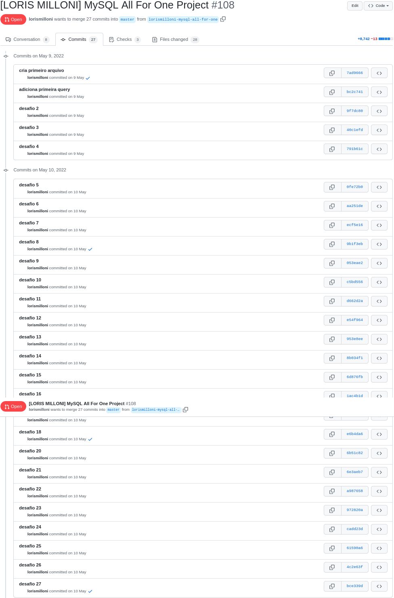
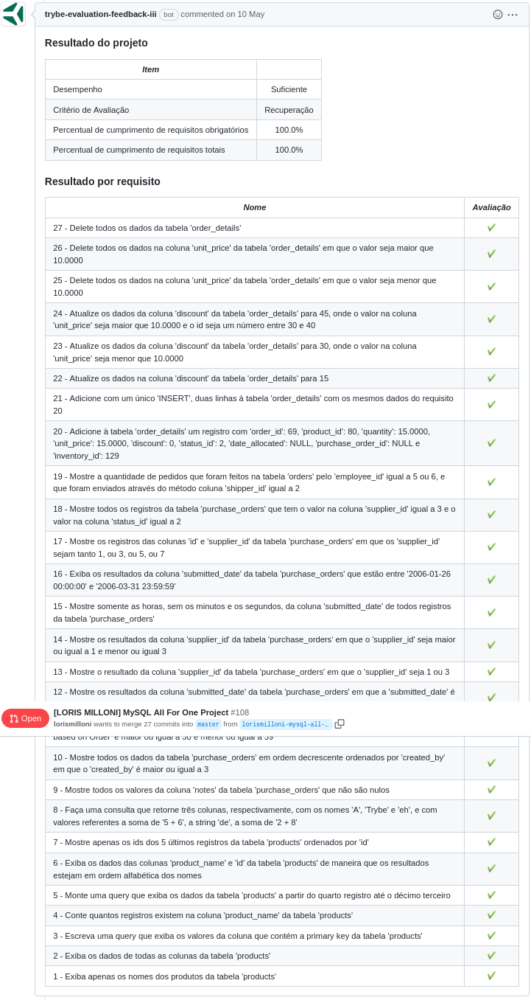

# studies-backend-mySQL
Made in **10/05/2022**.

## In this assignment I was learning my first queries in MySQL.
#### This was a very fun and simple assignment, all queries are in the challenges folder from 'desafio1' to 'desafio27'. The access to the database was made withing a Docker container, the goal was to manipulate the Northwind database to view data by name, ids and quantities from different tables. And also add, update and delete data.
 

#### Trybe has a private repository with files that can't be shared. So here is my commit history print:

#### Here is the Trybe Evaluator

